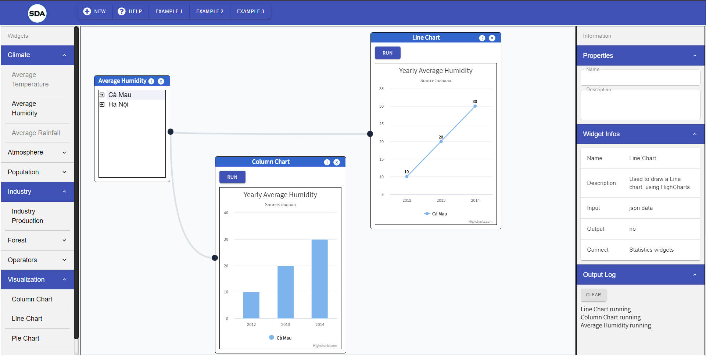
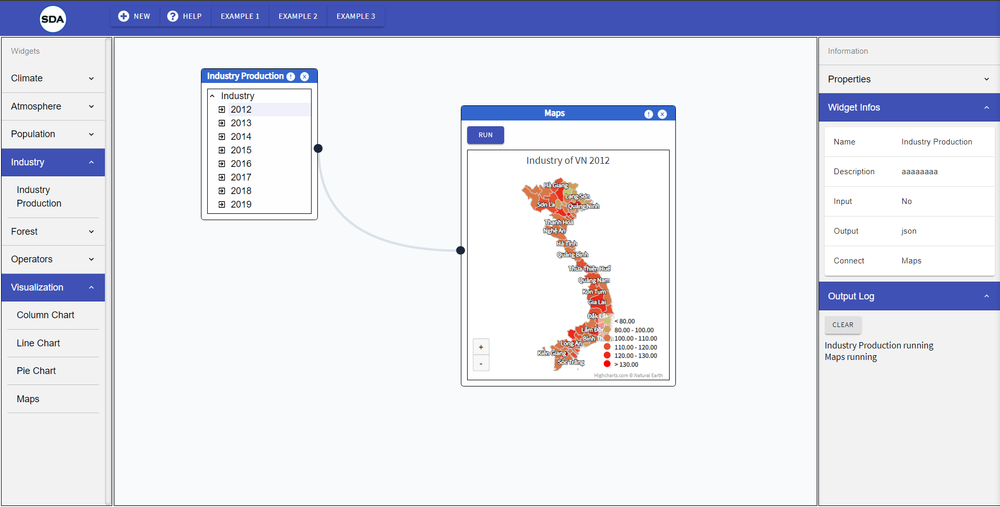

# Mini Project: Smart Dashboard Application - Client

## Date: 20 - Aug - 2020 to present

### Functions:

- Scientific research: Environment Analysis System in Vietnam
- Data Visualization in Charts, Maps:
  - Climate:
    - Temperature
      - Filter by Year
    - Humidity
      - Filter by City
    - Rainfall
  - Atmosphere
  - Population:
  - Industry
    - Filter by Year
  - Forest
  - Operators

### Releases

- https://sda-research.ml

### Screenshot




### Plan Of Action

1. Initial Project
2. Setup React & Install dependencies
3. Setup Router
4. Navbar component
5. InfoSection component
6. Add data to homepage
7. Create Navbar Dashboard
8. Implement Redux toolkit to app
9. Update Navbar Dashboard
10. Import Material-UI
11. Grid layout for Dashboard
12. Toolbar component
13. Initial content component
14. Setup draw diagrams
15. Refactor Toolbar component with Redux
16. addNewNode & removeNode
17. First layout of Node
18. Viz `Climate/Humidity` in TreeView
19. Initial `LineChart` & `ColumnChart`
20. `Info` container
21. `Properties` component
22. `Widget Infos` component
23. `Output Log` component
24. Viz `Industry/IndustryProduction` in TreeView
25. Initial `Maps`
26. Viz `Industry/IndustryProduction` 2012 in Maps
27. Viz `Humidity` in `LineChart`
28. Viz `Humidity` in `ColumnChart`
29. Draw connector when onClick on RUN btn
30. Clear all node when onClick on NEW btn
31. Fetch API year viz in Maps
32. Fetch API year viz in Table
33. Fetch API City viz in Column Chart
34. Fetch API City viz in Line Chart
35. Fetch API City viz in Table

### Next Steps:

- Fetch API humidity year viz in Chart
- Fetch API rainfall year viz in Chart

### API:

- /climate/humidity/city/:cityid;
- /climate/humidity/year/:yearid;
- /climate/humidity/city/:cityid/year/yearid;

- /climate/rainfall/city/:cityid;
- /climate/rainfall/year/:yearid;
- /climate/rainfall/city/:cityid/year/yearid;

- /climate/temperature/city/:cityid;
- /climate/temperature/year/:yearid;
- /climate/temperature/city/:cityid/year/yearid;

- /industry/city/:cityid;
- /industry/year/:yearid;
- /industry/city/:cityid/year/yearid;

### Directory Structure

```

.
├── package.json
├── package-lock.json
├── README.md
├── deploy-firebase
├── firebase.json
├── .gitignore
└── src
    ├── app
        ├── store.js
    ├── assets
        └── img
    ├── components
        ├── Footer
        ├── InfoSection
        ├── Navbar
        ├── UI
        ├── index.js
        └── ScrollToTop.jsx
    ├── pages
        ├── About
            ├── About.js
            └── Data.js
        ├── Contact
            ├── Contact.js
            └── Data.js
        ├── Dashboard
            ├── Dashboard.js
            └── Data.js
        └── HomePage
            ├── Homepage.js
            └── Data.js
    ├── App.js
    ├── GlobalStyles.js
    └── index.js
```

For the project to build, these must exist with exact filenames:

- `public/index.html` is the page template
- `src/index.js` is the entry point
- `src/GlobalStyles.js` is the Global Styles
- `src/App.js` is the Router

## Installation Guide

### Production

- Clone this project

```
git clone https://github.com/tinspham209/SDA-client
```

- Install dependencies

```
npm install
```

- Start the server

```
npm start
```

### Development

- Clone this project
- Install dependencies

```
npm install
```

- Start packager

```
npm start
```

### Tech-Stack

- react
- @material-ui
- react-icons
- react-router-dom
- styled-components
- @reduxjs/toolkit
- axios
- react-dnd
- beautiful-react-diagrams
- highcharts

### Folder function

- `app`: store redux
- `assets`: store image
- `components`:
- `container`:
- `pages`:
- `api`

### Component function

- i'll write it as soon as i can 😀

### How to name a folder and a file

- Folder name: - Ex: `InfoSection`
- Component file name: should be -- Ex: `InfoSection.jsx`
- Style component file name: should be -- Ex: `InfoSection.elements.js`

### How to import and export module?

- Import:

```js
//import every thing
import * as React from "react";
import * as ReactDOM from "react-dom";

//for default export
import InfoSection from "./InfoSection";

//for named export
import { InfoSec, InfoRow } from "./InfoSection.elements";
```

### How to style for each component?

- Create a styled-component file. Ex: `InfoSection.elements.js`
- Import to `jsx` file

```js
// InfoSection.jsx

import { InfoSec, InfoRow } from "./InfoSection.elements";
```

### How to deploy to firebase

i'll write it as soon as i can 😀

### How to setup Redux-Toolkit

i'll write it as soon as i can 😀

### How to update state in Redux of each component

i'll write it as soon as i can 😀
